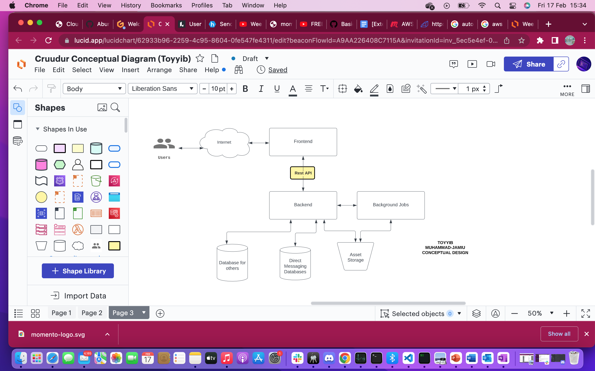
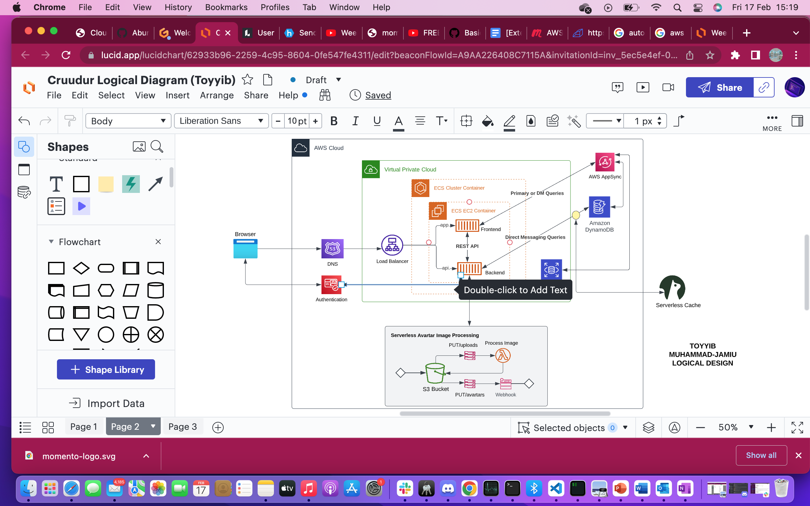

# Week 0 — Billing and Architecture

- [X] Task 1:

## Recreate Conceptual Diagram in Lucid Charts or on a Napkin

* Lucid Chart Conceptual Diagram 

Link: https://lucid.app/lucidchart/62933b96-2259-4c95-8604-0fe547fe4311/edit?viewport_loc=62%2C-234%2C1624%2C894%2C1RVxaKq~3Jpw&invitationId=inv_5ec5e4ef-0616-4fe1-afa2-dc3acb6cbf62

- [X] Task 2:
## Recreate Logical Diagram in Lucid Charts

Link: https://lucid.app/lucidchart/62933b96-2259-4c95-8604-0fe547fe4311/edit?viewport_loc=-353%2C305%2C2006%2C894%2CNRVxYiDKEcDh&invitationId=inv_5ec5e4ef-0616-4fe1-afa2-dc3acb6cbf62