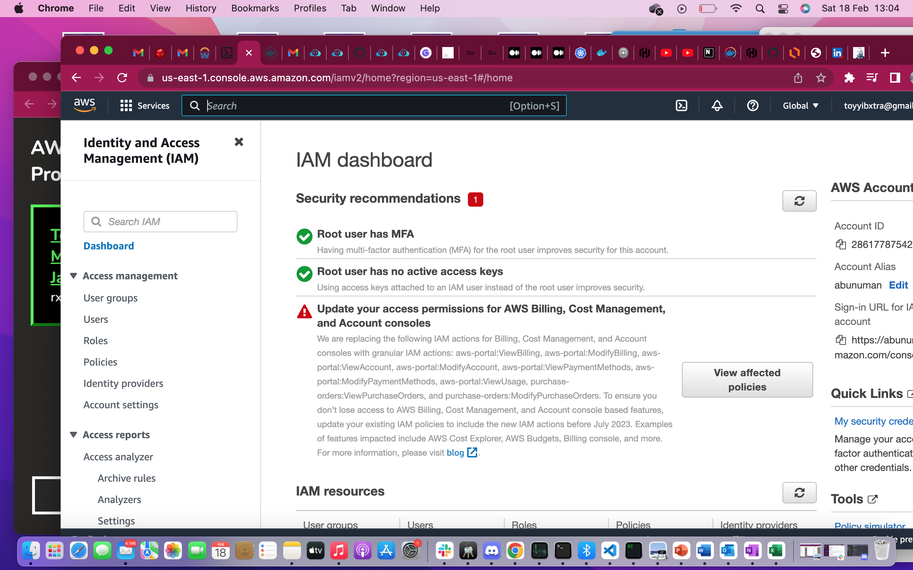
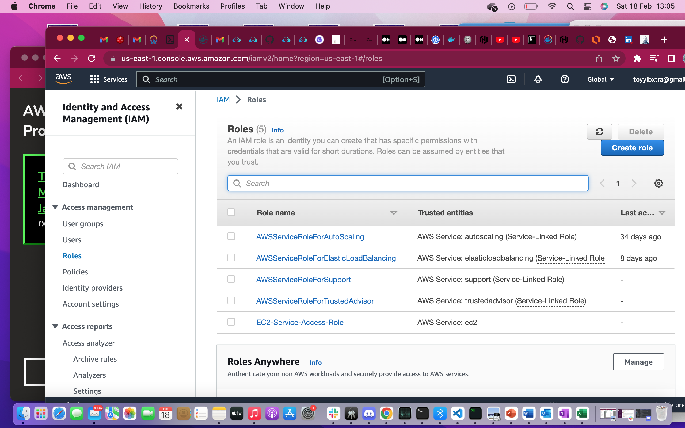
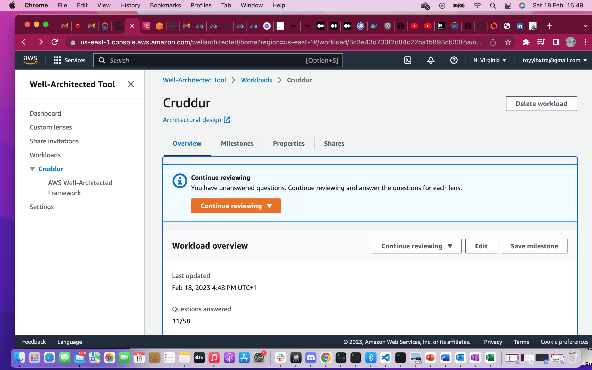
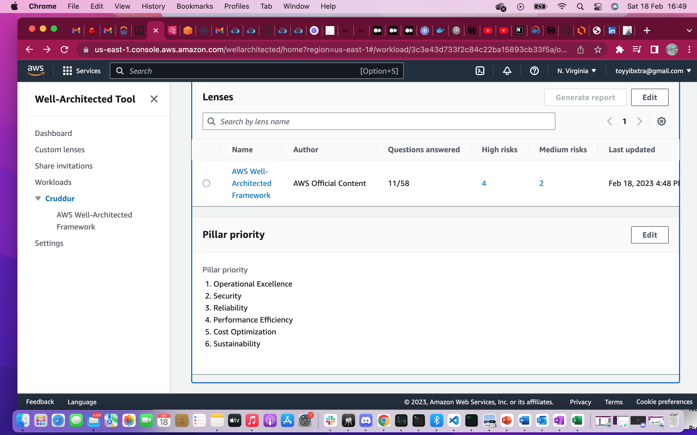
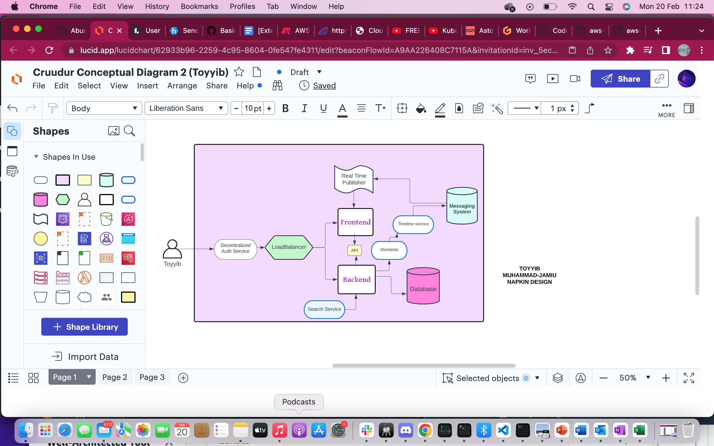
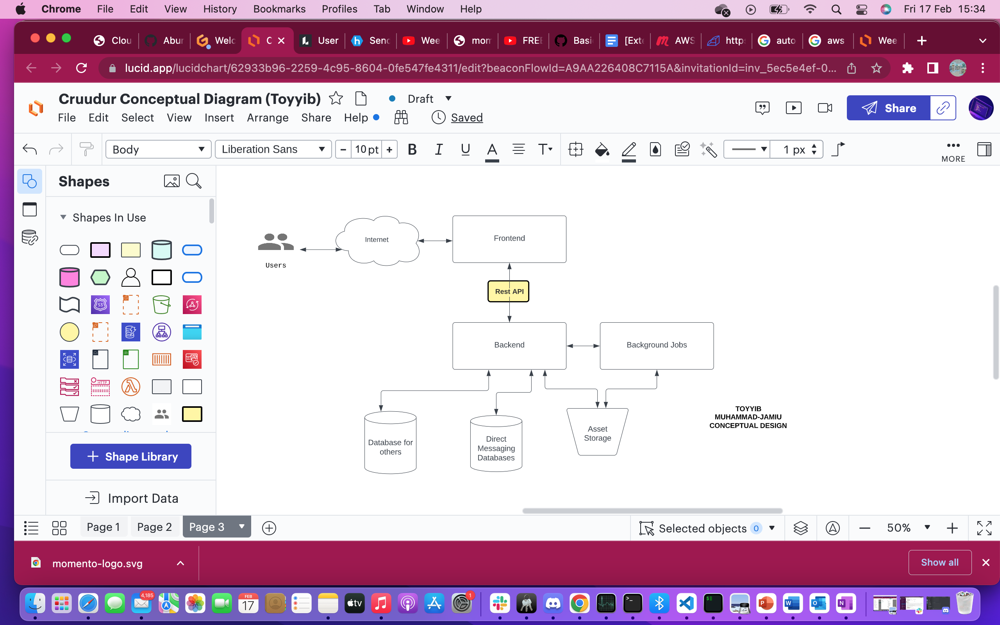
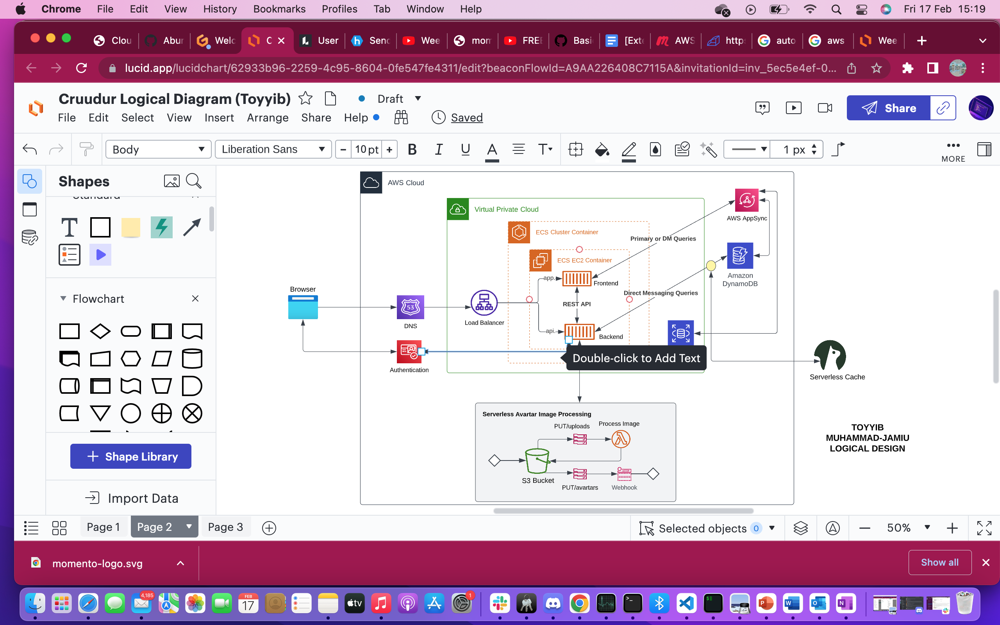

# Week 0 — Billing and Architecture

## Required Homework Challenge

- [X] Task 1:
### Install AWS CLI

* I was able to install AWS CLI using gitpod and hence could run aws commands from my terminal.
Running:

`$ curl "https://awscli.amazonaws.com/awscli-exe-linux-x86_64.zip" -o "awscliv2.zip"` \

 `$ unzip awscliv2.zip` \
 `$ sudo ./aws/install` 

* Using environment variables, I was able to pass in my AWS credentials.

` $ export AWS_ACCESS_KEY_ID="********"` \
` $ export AWS_SECRET_ACCESS_KEY="*************"` \
` $ export AWS_DEFAULT_REGION="******"` 

I also tried using aws configure just for a trial

`$ aws configure`
Then the following prompts came up while  I fill up the prompts accordingly

*AWS Access Key ID [None ]: *************** \
*AWS Secrete Access Key [None ]: ********************* \
*Default region name [None ]: my region* \
*Default output format [None ]: json*

 
- [X] Task 2:

## Set MFA and IAM Roles

**Proof for MFA set for Root**

**Proof for Roles set**

- [X] Task 3: 
## Billing Alarm
Setting up  SNS for a billing alarm notification

I used the following commands from the CLI to subscribe for SNS 
aws sns subscribe \
    --topic-arn="arn:aws:sns:region:12345678:my-topic" \
    --protocol email \
    --notification-endpoint=my mail

where:
 *region was set to my region* \
 *my-topic was set as "billing alarm"* \
 *I passed in my Account ID* \
 *My mail was set as my gmail account (toyyibxtra@gmail.com)* 

- [X] Task 4:

## Reviewing all the questions of each pillars in the Well Architected Tool (No specialized lens)

I was able to review 11 out of the 58 questions

- [X] Task 5:

## Recreate Conceptual and Logical Diagram in Lucid Charts 

* **Napkin Diagram** 

Here is the [Link](https://lucid.app/lucidchart/62933b96-2259-4c95-8604-0fe547fe4311/edit?viewport_loc=-450%2C-282%2C1542%2C1002%2C0_0&invitationId=inv_5ec5e4ef-0616-4fe1-afa2-dc3acb6cbf62
).

* **Lucid Chart Conceptual Diagram** 

Here is the [Link](https://lucid.app/lucidchart/62933b96-2259-4c95-8604-0fe547fe4311/edit?viewport_loc=62%2C-234%2C1624%2C894%2C1RVxaKq~3Jpw&invitationId=inv_5ec5e4ef-0616-4fe1-afa2-dc3acb6cbf62
).

* **Lucid Chart Logic Diagram**

Here is the [Link to design](https://lucid.app/lucidchart/62933b96-2259-4c95-8604-0fe547fe4311/edit?viewport_loc=-353%2C305%2C2006%2C894%2CNRVxYiDKEcDh&invitationId=inv_5ec5e4ef-0616-4fe1-afa2-dc3acb6cbf62).
