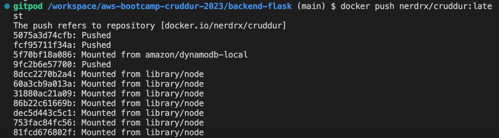

# Week 1 — App Containerization
## Technical Tasks
---

## Containerization of Apps using Docker following Checklist Guide

- [X] Task 1:

### Running Apps Locally

* I was able to clone the frontend and backend repo successfully and explored the codebases. 

* Thereafter I ensured the apps can run locally before implementing the use of Dockerfile and docker-compose file

- [X] Task 2:

### Writing Dockerfile
I thereafter wrote a Dockerfile for each app ensuring the apps run via individual container.

 - [X] Task 3:

### Creating docker-compose.yml file

I created a docker-compose file with the guide and understood writing yml file better than before. 

I ensured  multiple containers can run side by side and mounted directories so I can make changes while I code.

* **While running `docker-compose up`, I ran into some errors which are given below with their solutions given alongside:**

1. **A badly displayed Homepage** 

### SOLUTION:

I figured out the problem was with the frontend-react-js codebase, CSS to be specific.
 Having figured that out, I went to the `#DesktopNavigation.css ` and gave it a margin-left of 10px which gave a well displayed Homepage.

2. **The Timeline was not displaying**

 From the image refrenced above, it is obvious the timeline was missing. 
 
 ### SOLUTION:

 I inspected the containers and found out the backend was not healthy.
 
 I inspected the error and found out there was an issue with its build.

 Therefore, I did `docker-compose down` and ran `docker-compose up` again and had this: 

 

3. **The NotificationFeed**

I found out this 404 error when the notification was clicked on.

### SOLUTION:
Following through the guide from the tutor, I was able to get the notification working perfectly.

SOLUTION:

 - [X] Task 4:

### Adding DynamoDB Local and Postgres
After solving these errors, I proceeded to adding databases (Dynamodb and PostgresSQL)to the docker-compose file. 
I followed the tutor's guide in implementing these.

---
## Homework Challenges 

 - [X] Task 1:

### Running the dockerfile CMD as an external script

I created a script called external.sh and wrote a script to run the CMD command from the Dockerfile.
Here is the file:

This brought about some updates in the Dockerfile starting from `COPY ./external.sh /` thus:

Initially there were errors while trying to figure out the commands to link up the script with the Dockerfile
But when I figured out the right command, errors were eliminated.

 - [X] Task 2:

### Implementation of  a healthcheck in the V3 Docker compose file

I implemented a healthcheck for both front-end-react-js and backend-flask in the docker-compose.yml file thus:

The healthcheck for the four components in the docker-compose.yml file all returned green initially.

But after 60 seconds as stated in the healthcheck it returned an error, that shows two containers are unhealthy.

### SOLUTION:
I inspected the containers (frontend and backend) affected and found out **curl** used in the healthcheck section in the docker-compose.yml file had not been installed before.
Having gotten the error, I passed the command to install curl into their respective Dockerfiles thus:

- [X] Task 3:

### Tagging and Pushing Image to Dockerhub Repositories

**My Repository name: nerdrx/cruddur**

During this final exercise I was able to do, I tagged the *frontend-react-js-image:latest* to *nerdrx/cruddur:latest*.

After successfully tagging the image, I then pushed to my dockerhub repository.

I initially had a recurring error of image not found locally while trying push. 
After several attempts I found out that I mispelt **cruddur** as **cuddur** while tagging hence it couldn't find a match while pushing.

The following steps were followed:

1. Tagging:

2. Dockerhub account login from the CLI.

I already had an account "nerdrx"

3. Pushing to repo **nerdrx/cruddur**

4. Confirmation of Push on the Dockerhub repo

