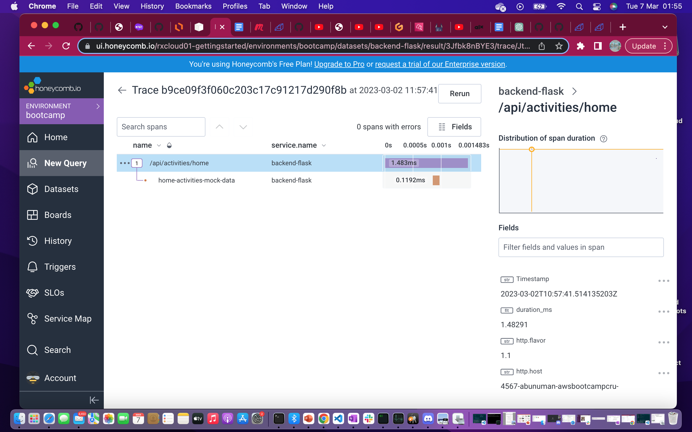
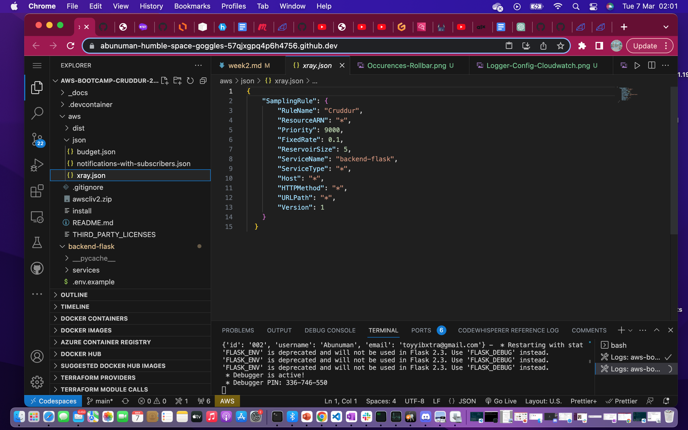
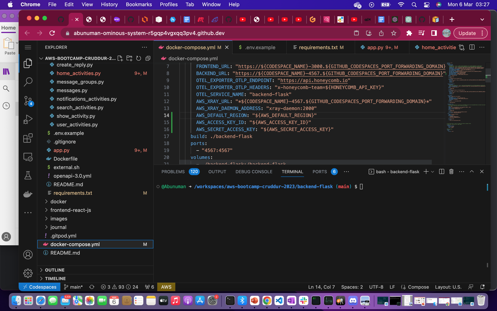

# Week 2 — Distributed Tracing

## Technical Tasks
---
- [X] TASK 1

* Instrument our backend flask application to use Open Telemetry (OTEL) with Honeycomb.io as the provider.

Opentelementry in the Requirement.txt

Honeycomb Provider 

* Run queries to explore traces within Honeycomb.io

Here are the results of the trace queries:

While running the home-activities logger querry, an error data occured 

After hours of debugging, it was found out to be a boolean written instead of a string data in the config file.
And this was corrected as seen in the picture below

- [X] TASK 2

* Instrument AWS X-Ray into backend flask application.

* Configure and provision X-Ray daemon within docker-compose and send data back to X-Ray API.

* Observe X-Ray traces within the AWS Console
It came back with some traces

After this task, I ran out of Gitpod Credit and had to set up a Codespace 
 I set it following the instructions. Here is a snippet of that:

 

Integrate Rollbar for Error Logging

Query received listening on Flask app

Install WatchTower and write a custom logger to send application log data to CloudWatch Log group

Watchtower

`pip install -r requirements.txt`

Custom Logger

## Homework Challenge
---

Add custom instrumentation to Rollbar to add more attributes, userid etc

